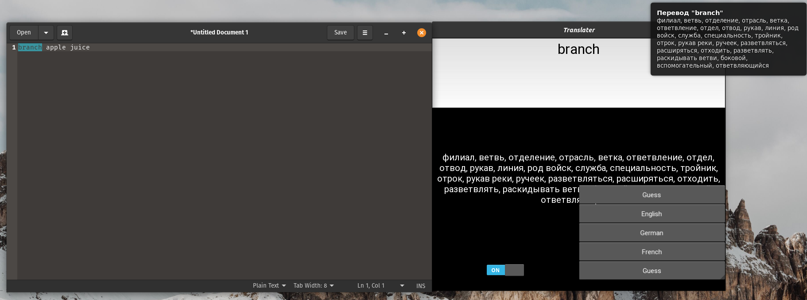

# Clipboard translater

App can be used for convenient word translation without distraction. Translation is implemented by Google  Translate API. Simply copy a word and get it's translation into russian.



## Installation

Ready-to-use binaries can be downloaded from [releases](https://github.com/krglkvrmn/Clipboard_translater/releases) section of this repository.

### Windows

Executable file is ready-to-use. However, you should allow Windows defender (or other antivirus) open it.

Launch might take a while.

### Linux

After downloading binary file you should install additional packages, which may be not found in your system: **xclip**, **libnotify**.

Example for Ubuntu based systems:

```bash
sudo apt install xclip
sudo apt-get install notify-osd
sudo apt install libnotify-bin
```

Run application as superuser (required for keystroke detection).

```bash
sudo ./translater > /dev/null &
```

## Manual build

Each branch (windows or linux build) is provided with ***.spec** file and **requirements.txt** file, which are needed for build.

### Dependencies

* python<=3.7.9 (App was tested on this and newer versions. Support of older python versions are not guaranteed).
* virtualenv
* Python libraries according to **requirements.txt** file.

### Build

Clone repository:

```bash
git clone https://github.com/krglkvrmn/Clipboard_translater.git
cd Clipboard_translater
```

Create virtual environment to isolate workspace and activate it.

```bash
virtualenv venv
source ./venv/bin/activate       # Linux
# or
venv\Scripts\activate.bat        # Windows
```

Switch to branch that matches your system.

```bash
git checkout [linux_build | windows_build]
```

Install dependencies (all dependencies will be stored inside virtual environment):

```bash
pip install -r requirements.txt
```

Open ***.spec** file and add replace path in *pathex* variable with absolute path to repository folder. Note that you should use **\\\\** as folder separator in Windows.

Build application with following command:

```bash
pyinstaller [build_linux.spec | build_windows.spec]
```

Binary application will be located in **dist** folder.

## Usage

Main feature of the application is distraction free translation. To enable this feature turn on switch in the bottom left of the window and choose target language.

Now copy a word or a fragment of text with <ctrl+c> of <ctrl+shift+c>. If everything is done right, notification containing copied fragment and it's possible translations will appear. This output will be duplicated in main application window, where you can also translate words by typing them into text field.

All words translated with selected language (all except "Guess") will be saved into corresponding ***.html** dictionary files. This includes three fields: word, translation and examples. Files are saved into directory where app is located.